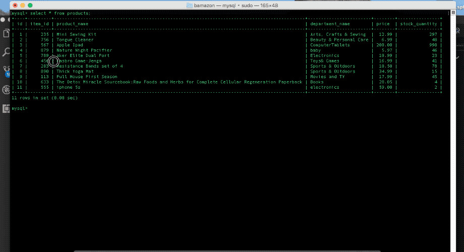

# bamazon
## By Perla E. Ballesteros

Bamazon Customer Interface

Bamazon Manager Interface

## Description:
Bamazon runs in the command line, there are two modes to bamazon, customer interface and manager interface.The customer interface allows users to purchase an item which calculates the total cost based on the quantity entered. The manager interface allows users to view existing inventory, add inventory to their store, or add new products. 

## Built With:
* [MySQL](https://www.mysql.com/) - Used to create database of products.
* [CLI Table](https://www.npmjs.com/package/cli-table) - Used for rendering tables in command line.
* [inquirer](https://www.npmjs.com/package/inquirer) - Used for createing the UI in command line.